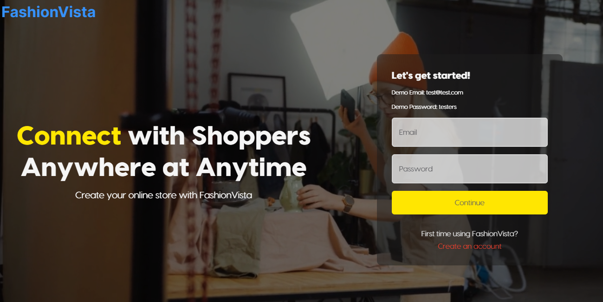

# FashionVista
FashionVista is an e-commerce platform that allows anyone to create an account, and then create their own fashion store. Users can choose their own custom subdomain for their store and share their store URL with others.

Contributors:
- Brandon Bhangari | [Github](https://github.com/curiousmind04) | [Portfolio](https://brandonbhangari.netlify.app/) | [LinkedIn](https://www.linkedin.com/in/brandon-bhangari/)
- Albert Ngodi | [Github](https://github.com/ngodi)
- Carlos Pereira | [Github](https://github.com/CarlosHenriqueMkt)
- Rachel Stroy | [Github](https://github.com/R-LaRoi)
- Diana Jordan | [Github](https://github.com/jordandc20)

[Live Site](https://fashionvista.vercel.app/)

[Example Store](https://fashionvista.vercel.app/store/brandonstore)

Demo Credentials: 

- Username is test@test.com
- Password is testers



This is a [Next.js](https://nextjs.org/) project bootstrapped with [`create-next-app`](https://github.com/vercel/next.js/tree/canary/packages/create-next-app).

Key Features:

- Create an account and sign in or use the demo credentials
- Create your own store page by entering a store title and a custom subdomain into the provided form
- Add products to your store from the dashboard page
- Add a custom store banner image and text from the dashboard page
- Archive/unarchive your products from the dashboard page
- Visit your store page
- Share your unique store page URL with others
- Use the search bar functionality to search for a product
- Open product detail modals for more info about a product
- Add products to your cart
- Checkout and finalize a purchase using Stripe
- View the order history for your store on the dashboard page

## Setting up the Project

### Cloning the repository

```shell
git clone git@github.com:chingu-voyages/v45-tier3-team-43.git
```
### Install packages

```shell
npm i
```

### Setup .env file

- The environment variable for the database URL can be found in your personal MongoDB account
- The environment variable for NextAuth is a random string of your choice
- The environment variable for Cloudinary can be found in your personal Cloudinary account
- The 2 environment variables for Stripe can be found in your personal Stripe account, follow Stripe instructions to get them

```js
DATABASE_URL=
NEXTAUTH_SECRET=
NEXT_PUBLIC_CLOUDINARY_CLOUD_NAME=
STRIPE_API_KEY=
STRIPE_WEBHOOK_SECRET=
```

### Connect to MongoDB and Push Prisma
```shell
npx prisma generate
npx prisma db push
```


### Start the app
```shell
npm run dev
```

### Available commands

Running commands with npm `npm run [command]`

| command         | description                              |
| :-------------- | :--------------------------------------- |
| `dev`           | Starts a development instance of the app |

Open [http://localhost:3000](http://localhost:3000) with your browser to see the result.

## Technologies/Tools Used
- Next.js
- React.js
- TypeScript
- Git/Github
- CSS Modules
- Cloudinary
- MongoDB
- NextAuth
- Stripe
- Prisma
- Vercel

## Dependencies
- [@next-auth/prisma-adapter](https://www.npmjs.com/package/@next-auth/prisma-adapter)
- [@prisma/client](https://www.npmjs.com/package/@prisma/client)
- [@types/node](https://www.npmjs.com/package/@types/node)
- [@types/react](https://www.npmjs.com/package/@types/react)
- [@types/react-dom](https://www.npmjs.com/package/@types/react-dom)
- [axios](https://www.npmjs.com/package/axios)
- [bcrypt](https://www.npmjs.com/package/bcrypt)
- [eslint](https://www.npmjs.com/package/eslint)
- [eslint-config-next](https://www.npmjs.com/package/eslint-config-next)
- [next](https://www.npmjs.com/package/next)
- [next-auth](https://www.npmjs.com/package/next-auth)
- [next-cloudinary](https://www.npmjs.com/package/next-cloudinary)
- [react](https://www.npmjs.com/package/react)  
- [react-dom](https://www.npmjs.com/package/react-dom)
- [react-hook-form](https://www.npmjs.com/package/react-hook-form)
- [react-hot-toast](https://www.npmjs.com/package/react-hot-toast)
- [react-icons](https://www.npmjs.com/package/react-icons)
- [stripe](https://www.npmjs.com/package/stripe)
- [typescript](https://www.npmjs.com/package/typescript)

## Dev Dependencies
- [@types/bcrypt](https://www.npmjs.com/package/@types/bcrypt)
- [prisma](https://www.npmjs.com/package/prisma)

## Learn More

To learn more about Next.js, take a look at the following resources:

- [Next.js Documentation](https://nextjs.org/docs) - learn about Next.js features and API.
- [Learn Next.js](https://nextjs.org/learn) - an interactive Next.js tutorial.

You can check out [the Next.js GitHub repository](https://github.com/vercel/next.js/) - your feedback and contributions are welcome!

## Team Documents

You may find these helpful as you work together to organize your project.

- [Team Project Ideas](./docs/team_project_ideas.md)
- [Team Decision Log](./docs/team_decision_log.md)

Meeting Agenda templates (located in the `/docs` directory in this repo):

- Meeting - Voyage Kickoff --> ./docs/meeting-voyage_kickoff.docx
- Meeting - App Vision & Feature Planning --> ./docs/meeting-vision_and_feature_planning.docx
- Meeting - Sprint Retrospective, Review, and Planning --> ./docs/meeting-sprint_retrospective_review_and_planning.docx
- Meeting - Sprint Open Topic Session --> ./docs/meeting-sprint_open_topic_session.docx
